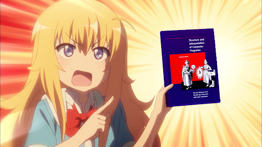
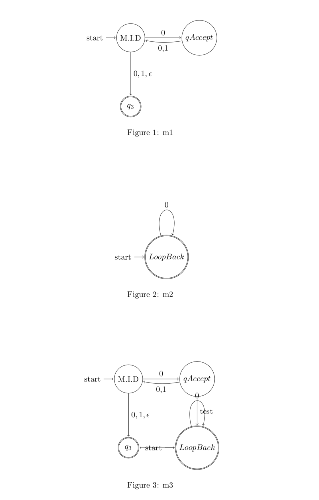

# STATES PRO



## CPSC 410 Team

- Chen Song
- Yuan Bian
- Xiuyuan Lu
- Zhenpeng Wu
- Jingwei Zhang

## Description

A DSL aims to draw state machines, turing machines, and Pushdown Automata.

## Sample translation result
https://www.overleaf.com/read/mrnvyyqcxdry

## How to use
- Install dependencies
```bash
npm i
```

- Translate samples/simple.btk
```bash
node index.js
```

- Verbose output to see logs and CST trees
```bash
node index.js -v
```

- Translate inputFile.btk
```bash
node index.js -f inputFile.btk
```

- Save latex result into outputFile.tex
```bash
node index.js -o outputFile.tex
```

## Goals

1. Design the language and come up with examples.
2. Decide which language to implement the this DSL.
3. Implement the language using javascript
4. Implement merge feature
5. Convert it to a MScode library (tool?) and extend other latex languages

## EBNF

```bnf

WhiteSpace ::= " " | "\t" | "\r"
LineBreak ::= "\n"
Letter ::= "a" | "b" | ... | "z" | "A" | ... | "Z"
Digit ::= "0" | "1" | "2" | ... | "9" ;
Symbol = "[" | "]" | "{" | "}" | "(" | ")" | "<" | ">" | "'" | '"' | "=" | "|" | "." | "," | ";" | "\";
String = { WhiteSpace | Letter | Digit | Symbol }

Label ::= StringLabel | LatexLabel | Identifier
LatexLabel ::= "$", String, "$"
StringLabel ::= "`", String, "`"
Identifier ::= Letter, { Letter | Digit | "_" }
PropIdentifier ::= Identifier, ".", Identifier

FigureType ::= 'StateMachine'

Program ::= DefineOperation, { DefineOperation | DrawOperation | MergeOperation }

DefineOperation ::= 'define', FigureType, Identifier, "{", LineBreak, DefineStmt, { DefineStmt }, "}", LineBreak
DefineStmt ::= Node, [ '->', Edge, { ",", Edge} ], LineBreak
Node ::= Identifier, [ "(", NodeState, [ ",", Label ], ")"]
Edge ::= Identifier, [ "(", Label, ")" ]
NodeState ::= 's' | 'f' | 'sf' | 'fs' | 'n'

DrawOperation ::= 'draw', Identifier, { Identifier }, LineBreak

MergeOperation ::= 'merge', FigureType, Identifier, Identifier, 'as', Identifier, "{", LineBreak, MergeStmt, { MergeStmt }, "}", LineBreak
MergeStmt ::= MergeNode, [ '->', MergeEdge, { ",", MergeEdge } ], LineBreak
MergeNode ::= PropIdentifier, [ "(", NodeState, [ ",", Label ], ")" ]
MergeEdge ::= PropIdentifier, [ "(", Label, ")" ]
```

## Examples

- More examples are showed in the [samples](./samples) folder

### Create State Machine

```
define StateMachine m1 {
  q1(sf, `M.I.D`) -> q2(`0`), q3($0,1,\epsilon$)
  q2(n, qAccept) -> q1(`0,1`)
  q3(f, $q_3$)
}
```

```
define StateMachine m2 {
  q5(sf, LoopBack) -> q5(`0`)
}
```

```latex
\begin{tikzpicture}[shorten >=1pt,node distance=3cm,on grid,auto]
	\node[state,initial] (q1)  {$\text{M.I.D}$};
	\node[state] (q2) [right=of q1] {$qAccept$};
	\node[state,accepting] (q3) [below=of q1] {$q_3$};
	\path[->]
	(q1) edge  node {$\text{0}$} (q2)
	(q1) edge  node {$0,1,\epsilon$} (q3)
	(q2) edge [bend left=10] node {$\text{0,1}$} (q1);
\end{tikzpicture}
\caption{m1} \label{fig:m1}

\begin{tikzpicture}[shorten >=1pt,node distance=3cm,on grid,auto]
	\node[state,initial,accepting] (q5)  {$LoopBack$};
	\path[->]
	(q5) edge [loop above] node {$\text{0}$} (q5);
\end{tikzpicture}
\caption{m2} \label{fig:m2}
```
### Merge State Machine

```
merge StateMachine m1 m2 as m3 {
    m1.q1(s)
    m1.q2 -> m2.q5(`test`)
    m2.q5 -> m1.q3
}
```

```latex
\begin{tikzpicture}[shorten >=1pt,node distance=3cm,on grid,auto]
	\node[state,initial] (m1_q1)  {$\text{M.I.D}$};
	\node[state] (m1_q2) [right=of m1_q1] {$qAccept$};
	\node[state,accepting] (m1_q3) [below=of m1_q1] {$q_3$};
	\node[state,initial,accepting] (m2_q5) [below=of m1_q2] {$LoopBack$};
	\path[->]
	(m1_q1) edge  node {$\text{0}$} (m1_q2)
	(m1_q1) edge  node {$0,1,\epsilon$} (m1_q3)
	(m1_q2) edge [bend left=10] node {$\text{0,1}$} (m1_q1)
	(m2_q5) edge [loop above] node {$\text{0}$} (m2_q5)
	(m1_q2) edge  node {$\text{test}$} (m2_q5)
	(m2_q5) edge  node {} (m1_q3);
\end{tikzpicture}
```

### Draw State Machine

```
draw m1, m2, m3
```

