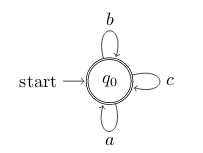

# STATES PRO

## CPSC 410 Perfect Team

- Chen Song
- Yuan Bian
- Xiuyuan Lu
- Zhenpeng Wu
- Jingwei Zhang

## Description

A DSL aims to draw state machines, turing machines, and Pushdown Automata.

## Goals

1. Design the language and come up with examples.
2. Decide which language to implement the this DSL.
3. Implement the language using javascript
4. Implement merge feature
5. Convert it to a MScode library (tool?) and extend other latex languages

## EBNF

```
DSL ::= 'define stateMachine :{' BODY '}'
ACTION ::= 'draw' | 'merge'
BODY ::= STATEMENT';'[ STATEMENT';']*
STATEMENT ::= NODELHS['->' NODERHS (',' NODERHS)*]?
NODELHS ::= string['(' STATE (',' LABEL )? ')']? // label is optional
STATE ::= 's' | 'f' | 'sf' | 'fs' | 'n'
NODERHS ::= string['(' LABEL ')']?
LABEL ::= string
```

1. Label in the NODELHS is optional, if users doesn't specify the label, we will use variable name as a default value.

## Examples

### Create State Machine

```
define stateMachine m {
    q1(s) -> q2(0), q3(1);
    q2(f);
    q3 -> q1(0), q4(0);
    q4(f) -> q1(\epsilon);
}
```

#### Loop Back Single State

```
define stateMchine m {
    q0(sf, $q_0$) -> q0(a), q0(b), q0(c);
}
```

```
\begin{tikzpicture}[shorten >=1pt,node distance=2.8cm,on grid,auto]
        \node[state,initial,accepting] (q0)   {$q_0$};
        \path[->]
            (q0) edge [loop above] node {$b$} (q0)
                 edge [loop below] node {$a$} (q0)
                 edge [loop right] node {$c$} (q0);
\end{tikzpicture}
```



### Merge State Machine

```
merge stateMachine m2 m1 as m3 {
    m1.q1(s); // merge must respecify start node
    m1.q2 -> m2.q3;
    m2.q1 -> m1.q4;
}
```
